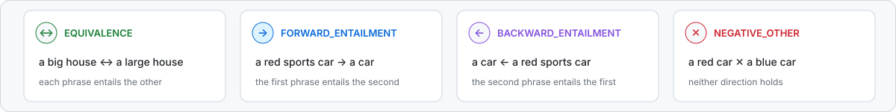
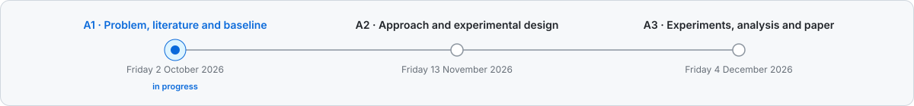

<picture>
  <source media="(prefers-color-scheme: dark) and (max-width: 640px)" srcset="assets/readme/hero-narrow-dark.svg">
  <source media="(max-width: 640px)" srcset="assets/readme/hero-narrow-light.svg">
  <source media="(prefers-color-scheme: dark)" srcset="assets/readme/hero-dark.svg">
  
</picture>

Given two short phrases in order, say how they relate: the same meaning, the first entails the second, the second entails the first, or neither. The scorer also shows every pair reversed. A system that answers "forward" one way has to answer "backward" the other, and two of the three official metrics, SoftCons and HardCons, measure exactly that. The third is weighted F1.

[Task page](https://inigolopezgazpio.net/SemEval-2027-Task-2-DiCo-NLI/) · [Data and official scorer](https://github.com/ilopezgazpio/SemEval-2027-Task-2-DiCo-NLI) · Tracks: English, Spanish, Basque and mixed. This project starts with English.

## The four relations

<picture>
  <source media="(prefers-color-scheme: dark)" srcset="assets/readme/relations-dark.svg">
  
</picture>

## Results

None yet. The first target is the organizers' pilot baseline on the English dev set, DeBERTa-v3-base at weighted F1 0.75, SoftCons 0.84 and HardCons 0.79, reproduced with our own seed and config. Every number that lands here links to a folder under [experiments/](experiments/) holding its seed, data version, config and command. The dev set is our test set, because the official test set is released in January 2027.

## Assignments

<picture>
  <source media="(prefers-color-scheme: dark)" srcset="assets/readme/timeline-dark.svg">
  
</picture>

Each assignment has a folder under [docs/deliverables/](docs/deliverables/) whose README lists its items and ticks them off as they land.

## Quick start

```
git clone https://github.com/Fawwad795/dico-nli-semeval2027-group-9.git
cd dico-nli-semeval2027-group-9
uv sync
uv run pytest
```

Requires [uv](https://docs.astral.sh/uv/). It installs Python 3.11 if the machine lacks it. Data download, the branch workflow, GPU access and the house rules are in [CONTRIBUTING.md](CONTRIBUTING.md).

## Layout

| Path | Holds |
|---|---|
| [src/dico_nli/](src/dico_nli/) | Library code: data loading, baselines, the method, evaluation glue. Every module lands after its test |
| [tests/](tests/) | `unit`, `integration` and `regression` tiers |
| [experiments/](experiments/) | One folder per run family: config, seed, command, data version, promoted results |
| [datasets/](datasets/) | Metadata and download instructions. Raw data stays out of git |
| [docs/deliverables/](docs/deliverables/) | What is handed in for A1, A2 and A3 |
| [docs/research/](docs/research/) | Literature notes and the reading log |
| [docs/paper/](docs/paper/) | The A3 paper and its figures |

## Team

Muhammad Shaheer Saleh · Ahmad Imran · Syed Fawwad Ahmed · Aqib Raza

Large Language Models course, semester 7, NUST. AI assistance on this repository is disclosed in [docs/governance/ai-usage-disclosure.md](docs/governance/ai-usage-disclosure.md).

---

<p align="center">
  <a href=".python-version">
    
  </a>
  <a href="https://docs.astral.sh/uv/">
    
  </a>
  <a href="tests/">
    
  </a>
  <a href="https://inigolopezgazpio.net/SemEval-2027-Task-2-DiCo-NLI/">
    
  </a>
</p>
